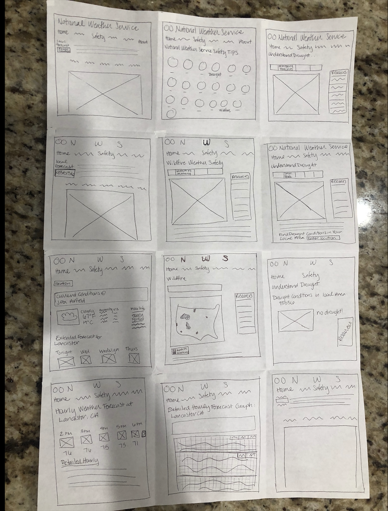
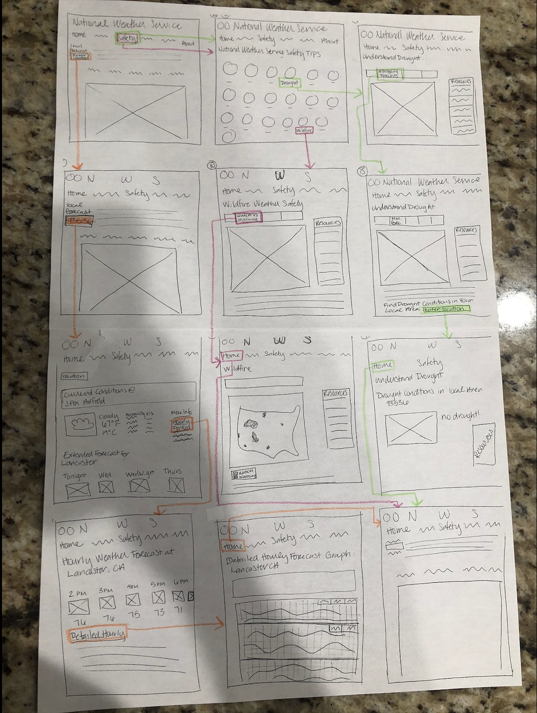
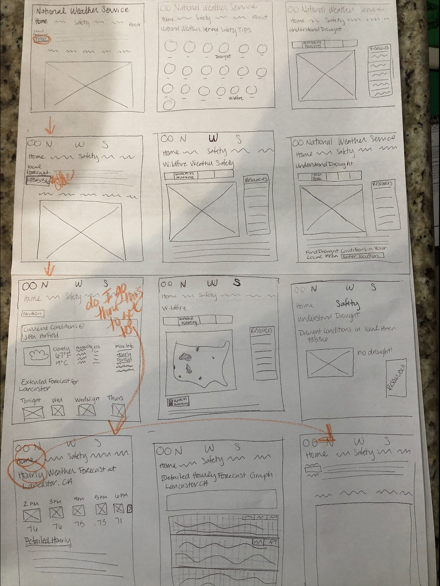
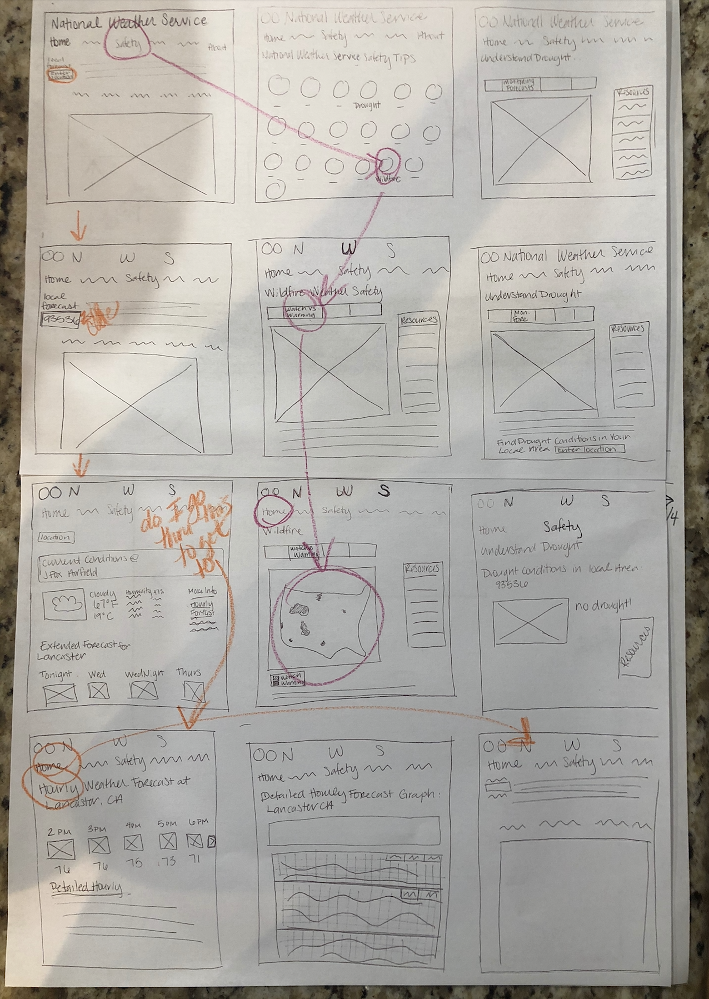
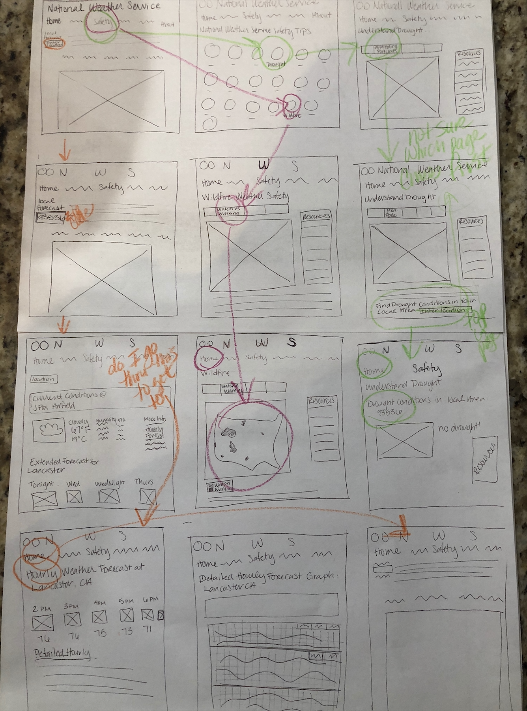

# DH150-Assignment06

## Emily DiPressi 

## Background 
#### *Purpose of Low Fidelity Prototyping and User Research*
This type of user research is very important. Mapping out exactly how a website will function is an integral step in creating a website that will be functional to the user. Low fidelity prototyping and wire flows are essential in testing how screens will work and how the user will use them. Getting in touch with the user and testing the flows and bring up issues that may not have been noticed before, but now after observing how a viewer uses the screen can help improve usability. 

### *Persona* 
Beth is a middle aged woman who lives in the desert and has weather that constantly fluctuates throughout the day. Being in the desert it is also very dry and makes drought an issue, but also makes wildfires a hazard. She uses weather.gov to check these features.

### *Tasks*
The three scenarios chosen for this task are:
1. Finding the hourly weather, a simplified version and one that is more detailed. 
2. Checking to see the status of drought in her area.
3. Checking to see if her area is in a wildfire watch or warning. 
* all tasks ended with the ability to navigate back home as well. 

Wireframe | Wireflow
--------- | --------
 | 

## Task 1

**_Hourly Forecast_**

The purpose of this task is to navigate from the home page to find the hourly weather report for her current location. This is as function of the website that needed to be changed because, the text to find the hourly weather was originally very hard to find. Also the hourly information presented was in a very hard to read graph. Not conducive to a fast, easy check. To remedy this, a new page would be created that presents the hourly forecast in a chart with the basic information: time, temperature, and icon. Users are able to click on the arrow at the right edge of the screen to view the next hours, that did not fit on the screen. There is still the option to have the detailed hourly forecast, underneath the new chart on a new page, for those users who want to know more, detailed hourly weather information. 

 

**_User Comments_**

The user was slightly confused doing this task. They wanted to skip screens and go to the final page. The user commented in orange: “do I go through this to get to [hourly weather forecast]?” The flow of the website, I think, was confusing to the user. The font sizes would be larger and clearer, because I think my user skipped over the “Hourly Forecast” section to click on to find the page with that information. 

## Task 2

**_Wildfires_**

**_User Comments_**

## Task 3

**_Drought_**

**_User Comments_**
